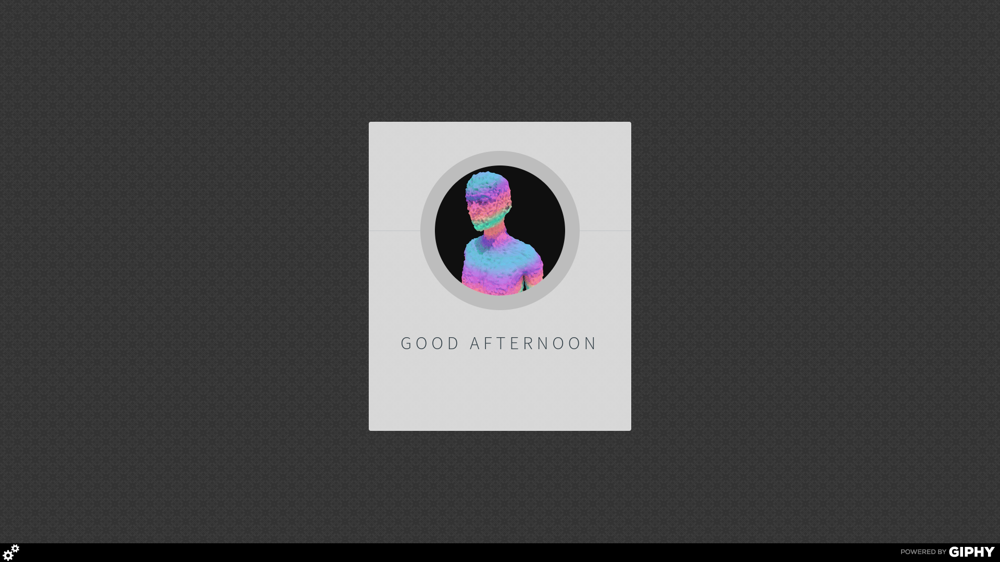

# HieroGIF

HieroGIF is a Chrome Extension that greets you with a fresh gif every time you open a new tab!

You can get HieroGIF on the [Chrome Web Store](https://chrome.google.com/webstore/detail/hierogif/dljfgojpciopkpbdciemghiagpoliebl).

If you want to modify the extension from this repo, you'll need to request a Giphy API key (get started [here](https://developers.giphy.com/)), and add it to Giphy.js

GiphyTab's styling is based off the "Identity" template from [HTML5UP](https://html5up.net/).
You can find the original README for the Identity template below.

------------------------------------------------------------------------

Identity by HTML5 UP
html5up.net | @ajlkn

Free for personal and commercial use under the CCA 3.0 license (html5up.net/license)

Just a fun little profile/card-style template I whipped up during a break between major
projects. Minimal, responsive, and powered by Skel + Sass. Enjoy :)

Demo images* courtesy of Unsplash, a radtastic collection of CC0 (public domain) images
you can use for pretty much whatever.

(* = not included)

AJ
aj@lkn.io | @ajlkn

Credits:

Demo Images:
Unsplash (unsplash.com)

Icons:
Font Awesome (fortawesome.github.com/Font-Awesome)

Other:
html5shiv.js (@afarkas @jdalton @jon_neal @rem)

CSS3 Pie (css3pie.com)

Respond.js (j.mp/respondjs)

Skel (skel.io)
